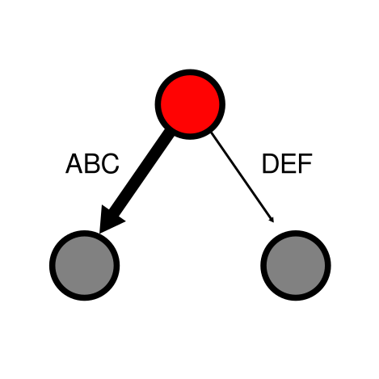

<!-- include logo-->


***

An Interface to Import and Modify SVG (XML) Graphic Files in R.

## Description

SVG is the primary choice for scalable, open-source graphic files. This packages provides a simple interface to import SVG graphic files in R, modify these in a programmatic way, and export the files again. The purpose of this package is to overlay scientific data on medium or large scale network representations, which is too laborious and time-consuming to do manually. SVG Graphics have to be drawn beforehand, for example using [Inkscape](https://inkscape.org/). Objects ("nodes") are than identified and modified using unique IDs/label in R. The fantastic [Escher](https://escher.github.io/#/) app follows a similar approach, where a metabolic network is first drawn on a canvas, and then used as a template to overlay metabolic, flux, gene expression or other data.
Options to customize the metabolic maps are too restricted.

Package info:

- Maintainer: Michael Jahn, Science for Life Lab, Stockholm
- License: GPL-3
- Depends: R (>= 3.5.0)
- Imports: `methods`, `XML`, `dplyr`

## Installation

To install the package directly from github, use the following function from the `devtools` package in your R session:

```{r, eval = FALSE}
devtools::install_github("m-jahn/fluctuator")
```


## Usage

### Read SVG

We can import a simple SVG file representing a network. The resulting `XMLsvg` has two slots, the original XML structure and a feature table with all graphical objects ("nodes") and their attributes.

```{r}
library(fluctuator)

# import example map
SVG <- read_svg("../images/example_network.svg")

# show class
class(SVG)

# get a summary
summary(SVG)
```
### Get attributes of SVG

We can search for certain nodes in the SVG and display their attributes. Note that nodes are objects, not to be confused with single points of a path.

```{r}
get_attributes(SVG, node = "node_1", attr = c("label", "style"))
get_attributes(SVG, node = "ABC", attr = c("label", "style"))
```

### Change attributes of SVG

The most important feature of this package is to change SVG attributes using the `set_attributes()` function.
The function takes four important arguments: the name (`label`) of the `node` whose attributes should be changed, and which corresponds to Inkscape object names. The `attribute` that is supposed to be changed (e.g. `style`). And a pattern + replacement that modifies the character value of the attribute.

In this example we change the fill color of `node_1` to red. Then we also change the thickness of the two arrows (reactions) `ABC` and `DEF`.

```{r}
SVG <- set_attributes(SVG, node = "node_1", attr = "style",
  pattern = "fill:#808080", replacement = "fill:#FF0000")

SVG <- set_attributes(SVG, node = c("ABC", "DEF"), attr = "style",
  pattern = "stroke-width:1.32291663", replacement = c("stroke-width:2.5", "stroke-width:0.5"))
```

### Export modified SVG file

Modified SVG files can be saved to disk using `write_svg()`.

```{r, eval = FALSE}
write_svg(SVG, file = "../images/example_network_mod.svg")
```

Original SVG                        |  Modified SVG
:-------------------------:|:-------------------------:
  |  


<!-- ### Real world example -->
