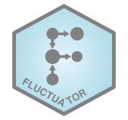
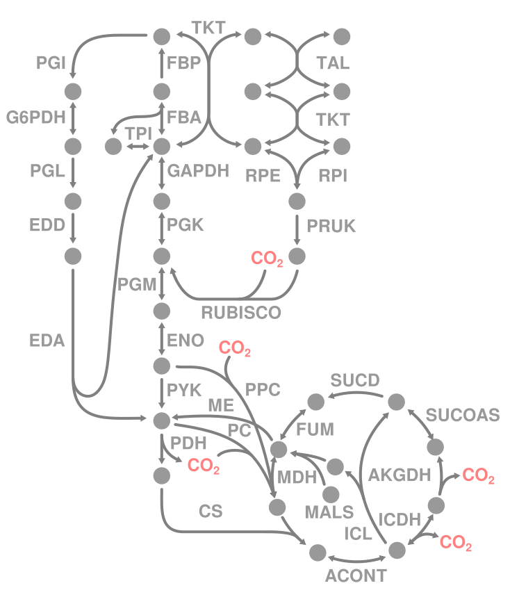
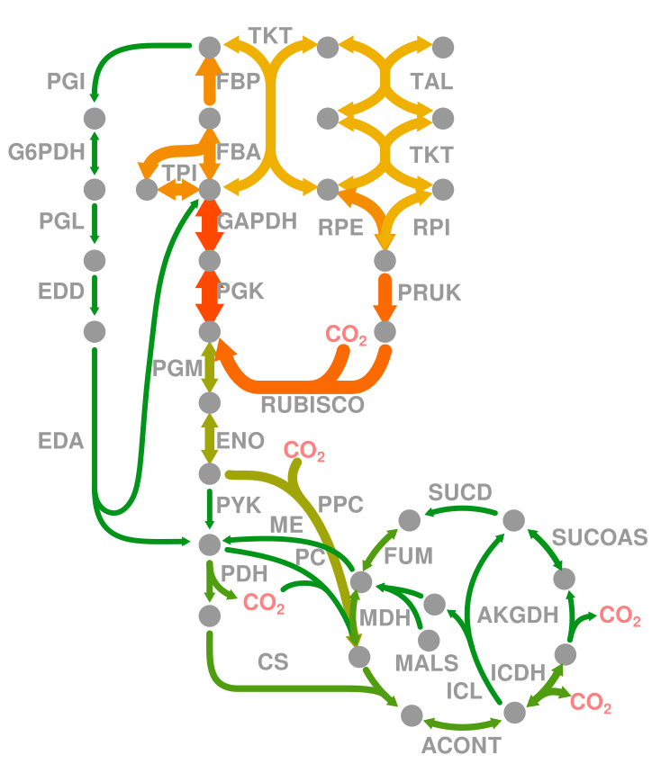
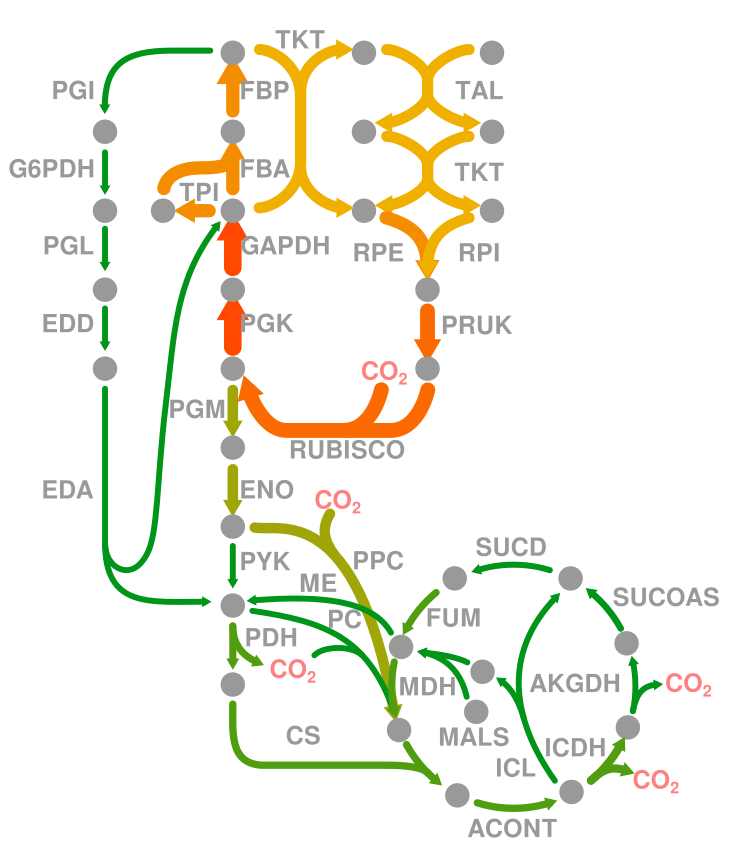
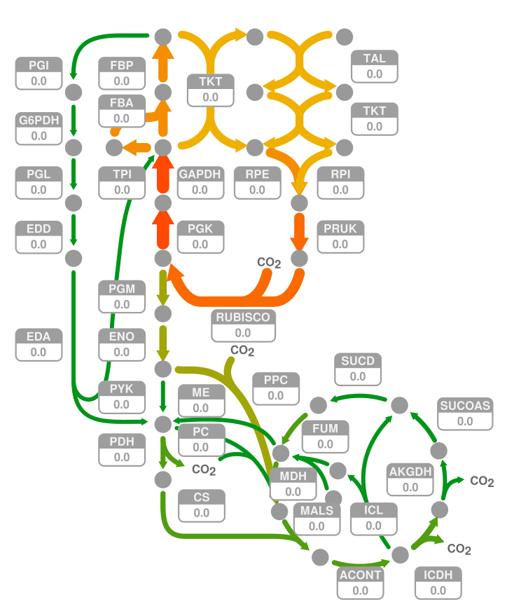
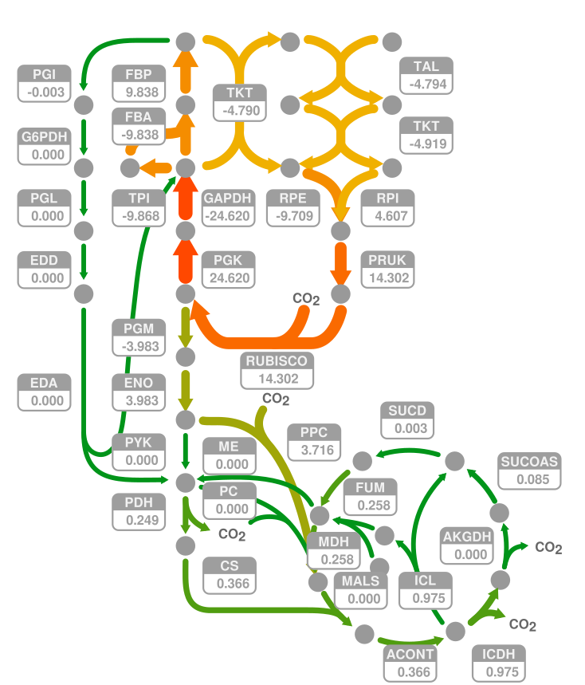

<!-- badges start -->
[](https://github.com/m-jahn/fluctuator/actions)
[](https://github.com/m-jahn)


<!-- badges end -->

<!-- include logo-->


***

An Interface to Import and Modify SVG (XML) Graphic Files in R.

## Description

SVG is the primary choice for scalable, open-source graphic files. This packages provides a simple interface to import SVG graphic files in R, modify these in a programmatic way, and export the files again. The purpose of this package is to overlay scientific data on medium or large scale network representations, which is too laborious and time-consuming to do manually. SVG Graphics have to be drawn beforehand, for example using [Inkscape](https://inkscape.org/). Objects ("nodes") are than identified and modified using unique IDs/label in R. The fantastic [Escher](https://escher.github.io/#/) app follows a similar approach, where a metabolic network is first drawn on a canvas, and then used as a template to overlay metabolic, flux, gene expression or other data.
Options to customize the metabolic maps are too restricted.

Package info:

- Maintainer: Michael Jahn, Science for Life Lab, Stockholm
- License: GPL-3
- Depends: R (>= 3.5.0)
- Imports: `methods`, `XML`, `dplyr`

## Installation

To install the package directly from github, use the following function from the `devtools` package in your R session:

```{r, eval = FALSE}
devtools::install_github("m-jahn/fluctuator")
```


## Usage

### Make an SVG template (with Inkscape)

The first step is to create an SVG file depicting e.g. a metabolic network. Inkscape is a free, open source software for vector images and natively supports SVG. Every item (node) that is created gets a cryptic label in Inkscape, such as `path-123-456-0-1`. All we need to do is to open the object dialog and change labels to more human readable names (see picture). These are later used to identify objects in R. I recommend using different prefixes for different types of objects, like `node_XYZ` for the nodes of a network, and `reaction_XYZ` for connections between nodes.

<!-- include logo-->


### Read SVG

We can then import the SVG file in R using `read_svg()`. The resulting object of class `XMLsvg` has two slots, the original XML structure and a feature table with all graphical objects (nodes) and their attributes.

```{r, message = FALSE}
library(dplyr)
library(fluctuator)

# import example map
SVG <- read_svg("../inst/extdata/example_network.svg")

# show class
class(SVG)

# access summary table of objects/nodes
head(SVG@summary)
```
### Get attributes of SVG

We can search for certain nodes in the SVG and display their attributes. Note that nodes are objects, not to be confused with single points of a path.

```{r}
get_attributes(SVG, node = "node_1", attr = c("label", "style"))
get_attributes(SVG, node = "ABC", attr = c("label", "style"))
```

### Change attributes of SVG

The most important feature of this package is to change SVG attributes using the `set_attributes()` function.
The function takes four important arguments: the name (`label`) of the `node` whose attributes should be changed, and which corresponds to Inkscape object names. The `attribute` that is supposed to be changed (e.g. `style`). And a pattern + replacement that modifies the character value of the attribute.

In this example we change the fill color of `node_1` to red. Then we also change the thickness of the two arrows (reactions) `ABC` and `DEF`.

```{r}
SVG <- set_attributes(SVG, node = "node_1", attr = "style",
  pattern = "fill:#808080", replacement = "fill:#FF0000")

SVG <- set_attributes(SVG, node = c("ABC", "DEF"), attr = "style",
  pattern = "stroke-width:1.32291663", replacement = c("stroke-width:2.5", "stroke-width:0.5"))
```

### Export modified SVG file

Modified SVG files can be saved to disk using `write_svg()`.

```{r, eval = FALSE}
write_svg(SVG, file = "../inst/extdata/example_network_mod.svg")
```

Original SVG                        |  Modified SVG
:-------------------------:|:-------------------------:
  |  


### Real world example

Let's import a reduced network of the central carbon metabolism of the bacterium *Cupriavidus necator*. We can inspect the Inkscape names of all reactions in the summary table (column `label`).


```{r}
SVG2 <- read_svg("../inst/extdata/central_metabolism.svg")
head(SVG2@summary)
```

The network has objects for metabolites, reactions, and reaction text labels. We want to modify thickness of arrows representing flux through reactions. We import a table with flux data matching the reactions in the SVG file.

```{r}
data(metabolic_flux)
head(metabolic_flux)
```

Then we inspect the style of the nodes that we want to change, and find the text bit for `stroke-width`.

```{r}
get_attributes(SVG2, node = "GAPDH") %>% pull(style)
```

As some reactions have very high flux and others no flux at all, we apply a square root transformation to the fluxes so that stroke width is more balanced.

```{r}
metabolic_flux_for <- metabolic_flux %>%
  filter(substrate == "formate") %>%
  mutate(stroke_width = 0.5 + 0.2*sqrt(abs(flux_mmol_gDCW_h)))

SVG2 <- set_attributes(SVG2,
  node = metabolic_flux_for$reaction, attr = "style",
  pattern = "stroke-width:[0-9]+\\.[0-9]+",
  replacement = paste0("stroke-width:", metabolic_flux_for$stroke_width))
```

We can also change the color according to metabolic flux.

```{r}
# make color palette
pal <- colorRampPalette(c("#ABABAB", "#009419", "#F0B000", "#FF4800"))(10)

metabolic_flux_for <- metabolic_flux_for %>%
  mutate(
    stroke_color = stroke_width %>% {1+(./max(.))*9} %>% round,
    stroke_color_rgb = pal[stroke_color])

SVG2 <- set_attributes(SVG2,
  node = metabolic_flux_for$reaction, attr = "style",
  pattern = "stroke:#808080",
  replacement = paste0("stroke:", metabolic_flux_for$stroke_color_rgb))
```

And for better look, reduce the size of the arrow heads. Arrow heads are called `marker` in Inkscape SVG (note that node name attribute changed to `id`). To modify size, we change the `transform` field of the marker nodes. Needs to be done separately for start and end arrows.

```{r}
SVG2 <- set_attributes(SVG2, 
  node = grep("marker", SVG2@summary$id, value = TRUE),
  node_attr = "id",
  attr = "transform",
  pattern = "scale\\(0.2\\)",
  replacement = "scale(0.15)")

SVG2 <- set_attributes(SVG2, 
  node = grep("marker", SVG2@summary$id, value = TRUE),
  node_attr = "id",
  attr = "transform",
  pattern = "scale\\(-0.2\\)",
  replacement = "scale(-0.15)")
```

Export the modified SVG file.

```{r}
write_svg(SVG2, file = "../inst/extdata/central_metabolism_mod.svg")
```


Original SVG               |  SVG with overlaid fluxes
:-------------------------:|:-------------------------:
  |  

### Advanced modifications

Practically every object of the SVG files can be modified in R. Here is an (incomplete) list of modifications that can be useful when working with metabolic maps, or other scientific images that profit from overlaying numerical data.

#### Change directionality of arrows

Some reactions in the previous example are reversible, hence they have arrows at the start and at the end. However, the flux in one particular condition can only go in one direction. To visualize *only forward* or *only backward* flux, we can remove arrow heads from selected reactions. In the example below the `marker-end:...` string is removed for all reactions with negative flux and the `marker-start:...` string for all reactions with positive flux.

```{r}
SVG2 <- set_attributes(SVG2,
  node = filter(metabolic_flux_for, flux_mmol_gDCW_h < 0)$reaction,
  attr = "style",
  pattern = "marker-end:url\\(#marker[0-9]*\\);",
  replacement = "")

SVG2 <- set_attributes(SVG2,
  node = filter(metabolic_flux_for, flux_mmol_gDCW_h >= 0)$reaction,
  attr = "style",
  pattern = "marker-start:url\\(#marker[0-9]*\\);",
  replacement = "")

write_svg(SVG2, file = "../inst/extdata/central_metabolism_direction.svg")
```


SVG with overlaid fluxes   |  SVG with correct directionality
:-------------------------:|:-------------------------:
  |  

#### Add numeric flux data

We can also change text fields in the SVG file and by these means add numeric flux data. All we need is a template that has predefined text fields, whose values are then changed using `set_values()`. Values are different "fields" in XML files and therefore require an own modification function. We can load a template map that has text fields named `value_REACTION`.
First we can inspect the current values using `get_values()` analogously to `get_attributes()`.

```{r}
SVG3 <- read_svg("../inst/extdata/central_metabolism_values.svg")
get_values(SVG3, node = c("value_ACONT", "value_AKGDH", "value_CS"))
```

Then we set new values.

```{r}
SVG3 <- set_values(SVG3,
  node = paste0("value_", metabolic_flux_for$reaction),
  value = round(metabolic_flux_for$flux_mmol_gDCW_h, 3)
)

write_svg(SVG3, file = "../inst/extdata/central_metabolism_values_filled.svg")
```

SVG template for values   |  SVG with added flux values
:-------------------------:|:-------------------------:
  |  
