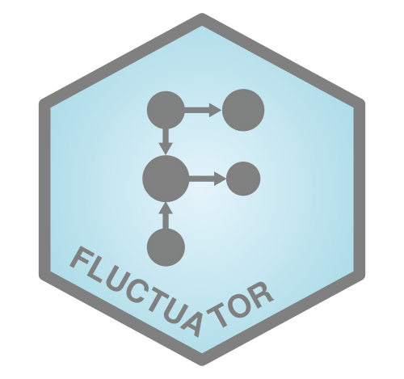
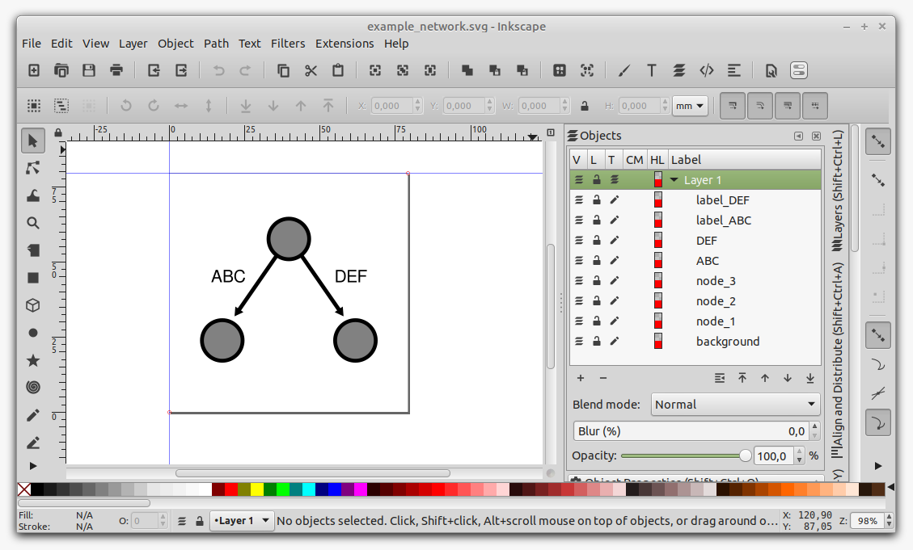
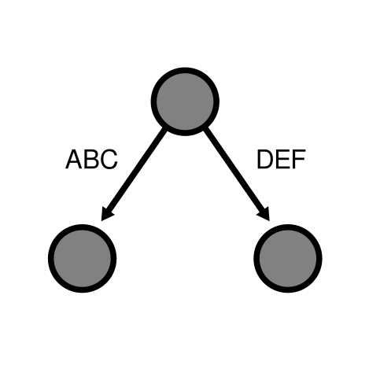
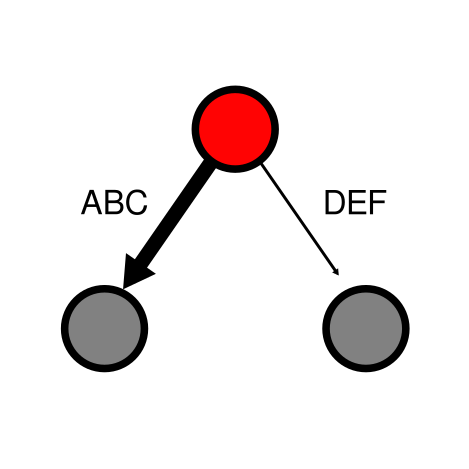

fluctuator
================
Michael Jahn
2021-05-21

<!-- include logo-->



-----

An Interface to Import and Modify SVG (XML) Graphic Files in R.

## Description

SVG is the primary choice for scalable, open-source graphic files. This
packages provides a simple interface to import SVG graphic files in R,
modify these in a programmatic way, and export the files again. The
purpose of this package is to overlay scientific data on medium or large
scale network representations, which is too laborious and time-consuming
to do manually. SVG Graphics have to be drawn beforehand, for example
using [Inkscape](https://inkscape.org/). Objects (“nodes”) are than
identified and modified using unique IDs/label in R. The fantastic
[Escher](https://escher.github.io/#/) app follows a similar approach,
where a metabolic network is first drawn on a canvas, and then used as a
template to overlay metabolic, flux, gene expression or other data.
Options to customize the metabolic maps are too restricted.

Package info:

  - Maintainer: Michael Jahn, Science for Life Lab, Stockholm
  - License: GPL-3
  - Depends: R (\>= 3.5.0)
  - Imports: `methods`, `XML`, `dplyr`

## Installation

To install the package directly from github, use the following function
from the `devtools` package in your R session:

``` r
devtools::install_github("m-jahn/fluctuator")
```

## Usage

### Make an SVG template (with Inkscape)

The first step is to create an SVG file depicting e.g. a metabolic
network. Inkscape is a free, open source software for vector images and
natively supports SVG. Every item (node) that is created gets a cryptic
label in Inkscape, such as `path-123-456-0-1`. All we need to do is to
open the object dialog and change labels to more human readable names
(see picture). These are later used to identify objects in R. I
recommend using different prefixes for different types of objects, like
`node_XYZ` for the nodes of a network, and `reaction_XYZ` for
connections between nodes.

<!-- include logo-->



### Read SVG

We can then import the SVG file in R using `read_svg()`. The resulting
object of class `XMLsvg` has two slots, the original XML structure and a
feature table with all graphical objects (nodes) and their attributes.

``` r
library(fluctuator)

# import example map
SVG <- read_svg("../images/example_network.svg")

# show class
class(SVG)
```

    ## [1] "XMLsvg"
    ## attr(,"package")
    ## [1] "fluctuator"

``` r
# access summary table of objects/nodes
head(SVG@summary)
```

    ## # A tibble: 6 x 22
    ##   node_no id     d       style   transform `connector-curv… node_set label cx   
    ##   <chr>   <chr>  <chr>   <chr>   <chr>     <chr>            <chr>    <chr> <chr>
    ## 1 1       path4… M 5.77… fill:#… scale(0.… 0                path     <NA>  <NA> 
    ## 2 2       path4… M 5.77… fill:#… scale(0.… 0                path     <NA>  <NA> 
    ## 3 3       path4… M 52.2… fill:#… <NA>      0                path     ABC   <NA> 
    ## 4 4       path4… M 60.7… fill:#… <NA>      0                path     DEF   <NA> 
    ## 5 5       path4… <NA>    color:… <NA>      <NA>             circle   node… 56.4…
    ## 6 6       path4… <NA>    color:… <NA>      <NA>             circle   node… 34.3…
    ## # … with 13 more variables: cy <chr>, r <chr>, stockid <chr>, orient <chr>,
    ## #   refY <chr>, refX <chr>, isstock <chr>, space <chr>, x <chr>, y <chr>,
    ## #   role <chr>, width <chr>, height <chr>

### Get attributes of SVG

We can search for certain nodes in the SVG and display their attributes.
Note that nodes are objects, not to be confused with single points of a
path.

``` r
get_attributes(SVG, node = "node_1", attr = c("label", "style"))
```

    ## # A tibble: 1 x 2
    ##   label  style                                                                  
    ##   <chr>  <chr>                                                                  
    ## 1 node_1 color:#000000;clip-rule:nonzero;display:inline;overflow:visible;visibi…

``` r
get_attributes(SVG, node = "ABC", attr = c("label", "style"))
```

    ## # A tibble: 1 x 2
    ##   label style                                                                   
    ##   <chr> <chr>                                                                   
    ## 1 ABC   fill:#000000;fill-opacity:1;fill-rule:evenodd;stroke:#000000;stroke-wid…

### Change attributes of SVG

The most important feature of this package is to change SVG attributes
using the `set_attributes()` function. The function takes four important
arguments: the name (`label`) of the `node` whose attributes should be
changed, and which corresponds to Inkscape object names. The `attribute`
that is supposed to be changed (e.g. `style`). And a pattern +
replacement that modifies the character value of the attribute.

In this example we change the fill color of `node_1` to red. Then we
also change the thickness of the two arrows (reactions) `ABC` and `DEF`.

``` r
SVG <- set_attributes(SVG, node = "node_1", attr = "style",
  pattern = "fill:#808080", replacement = "fill:#FF0000")

SVG <- set_attributes(SVG, node = c("ABC", "DEF"), attr = "style",
  pattern = "stroke-width:1.32291663", replacement = c("stroke-width:2.5", "stroke-width:0.5"))
```

### Export modified SVG file

Modified SVG files can be saved to disk using `write_svg()`.

``` r
write_svg(SVG, file = "../images/example_network_mod.svg")
```

|            Original SVG            |              Modified SVG              |
| :--------------------------------: | :------------------------------------: |
|  |  |

<!-- ### Real world example -->
